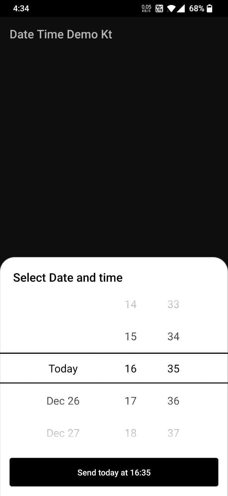
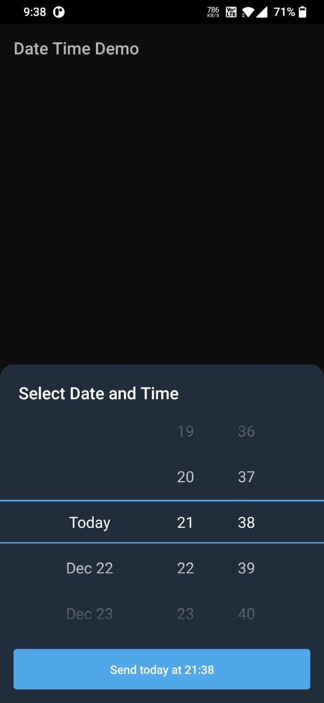

## UnifiedDateTimePicker
UnifiedDateTimePicker would help you pick Date and Time with just single UI component. It's inspired & took from Telegram and extended with all the customization to fulfill the needs of any modern app.

Java version of the library is also available here:
> https://github.com/BobbySandhu/unified-date-time-picker

### Usage

    UnifiedDateTimePicker.Builder(this)
                .title("Select Date and Time")
                .addListener(object : OnDateTimeSelectedListener {
                    override fun onDateTimeSelected(millis: Long) {
                        val sdf = SimpleDateFormat(DATE_FORMAT_Z, Locale.ROOT)
                        val calendar: Calendar = Calendar.getInstance()
                        calendar.timeInMillis = millis

                        binding.textDateTime.text = sdf.format(calendar.time)
                    }

                    override fun onPickerDismissed(millis: Long) {
                        /* no use as of now */
                    }
                })
                .show();

With default setting it would look like this:

### Customizations

    UnifiedDateTimePicker.Builder(this)
                .title("Select Date and Time")
                .titleTextColor(R.color.white)
                .backgroundColor(R.color.big_stone)
                .dateTimeTextColor(R.color.white)
                .buttonColor(R.color.picton_blue)
                .buttonTextColor(R.color.white)
                .vibration(true) // heptic feedback when values are scrolled
                //.setDateTimeMillis(/* long milliseconds*/)
                .addListener(object : OnDateTimeSelectedListener {
                    override fun onDateTimeSelected(millis: Long) {
                        val sdf = SimpleDateFormat(DATE_FORMAT_Z, Locale.ROOT)
                        val calendar: Calendar = Calendar.getInstance()
                        calendar.timeInMillis = millis

                        binding.textDateTime.text = sdf.format(calendar.time)
                    }

                    override fun onPickerDismissed(millis: Long) {
                        /* no use as of now */
                    }
                })
                .show();

With all these customizations applied, it would look like:

### Implementation

    // Top level build file
    repositories {
        // Add this to the end of any existing repositories
        mavenCentral()
    }
    
    // app level dependencies section
    dependencies {
        implementation 'io.github.bobbysandhu:unified-date-time-picker-kt:1.0.0'
    }

Want to extend the feature, have any improvement or bug fix? 

    You can contribute and help the community. All you need to do is share your PR with clear message. That's it!!

